# Fibbers card gallery

Every card, with a live example and copy-paste Lovelace YAML, runs in the
[Storybook demo](https://elian0213.github.io/fibbers-home-assistant/) — open a card and hit
**Show code**. The thumbnails below are a static overview; the demo is the reference.

Back to the [README](../README.md).

## Shell & navigation

The app shell: a pinned bottom bar (sidebar-aware on desktop), a back button that remembers its
stack, drag-up modal sheets, a section label, and the greeting header.

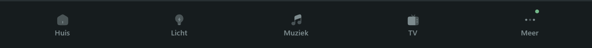

<table>
<tr>
<td width="33%" align="center">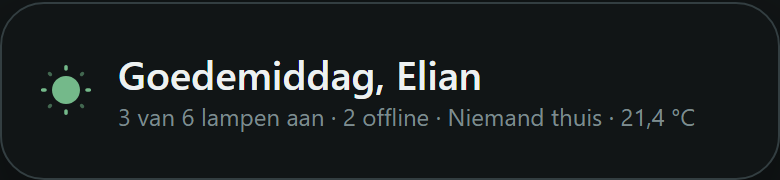 <code>fibbers-greeting</code> time-of-day header</td>
<td width="33%" align="center">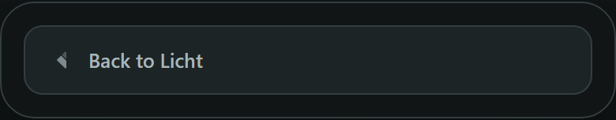 <code>fibbers-back</code> back with memory</td>
<td width="33%" align="center">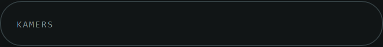 <code>fibbers-section</code> section label</td>
</tr>
</table>

## Rooms, lights & scenes

Room tiles that count their own lights, a master light-group control, a light row with a slider,
the Hue-style colour picker (the light modal), scene tiles, and action chips.

<table>
<tr>
<td width="33%" align="center">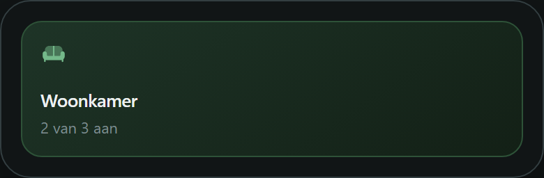 <code>fibbers-room</code> counts its own lights</td>
<td width="33%" align="center">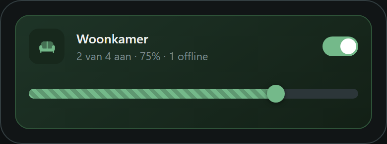 <code>fibbers-light-group</code> master control</td>
<td width="33%" align="center">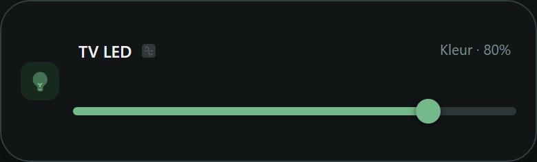 <code>fibbers-light-row</code> brightness slider</td>
</tr>
<tr>
<td width="33%" align="center">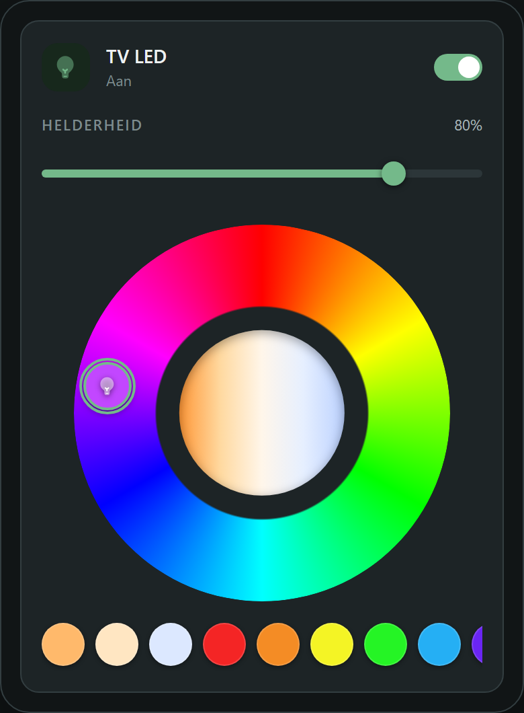 <code>fibbers-light-detail</code> room colour picker</td>
<td width="33%" align="center">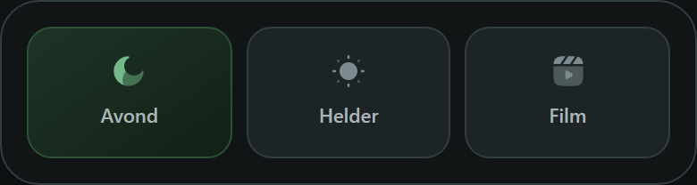 <code>fibbers-scene</code> scene tiles</td>
<td width="33%" align="center">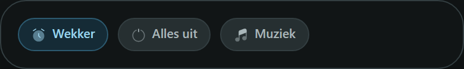 <code>fibbers-chips</code> action pills</td>
</tr>
</table>

## Status & data

An alert card built from real checks, value tiles, a history sparkline, a self-filtering entity
list, presence, backups, weather, and host telemetry.

<table>
<tr>
<td width="33%" align="center">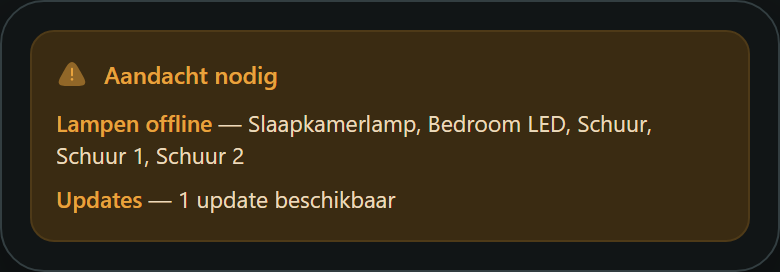 <code>fibbers-alert</code> real checks</td>
<td width="33%" align="center">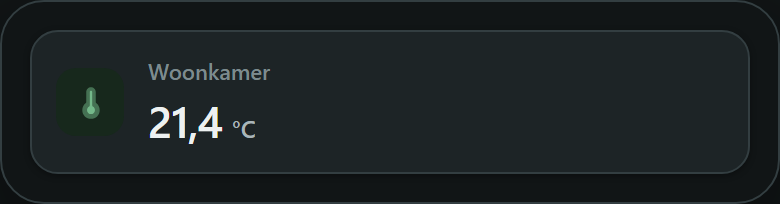 <code>fibbers-stat</code> value tile</td>
<td width="33%" align="center">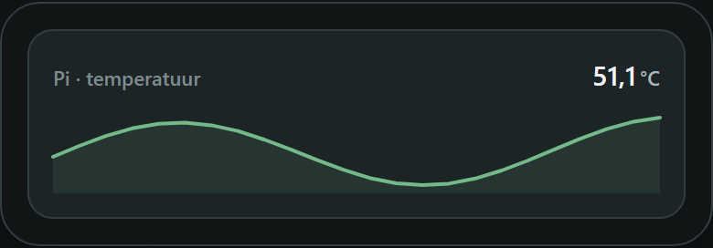 <code>fibbers-graph</code> history sparkline</td>
</tr>
<tr>
<td width="33%" align="center">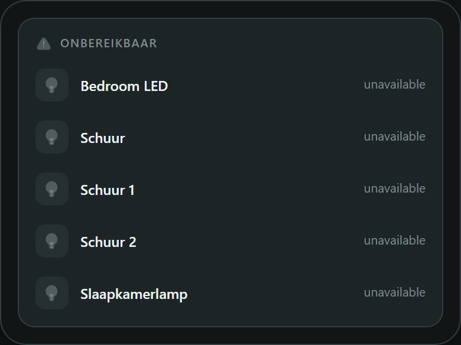 <code>fibbers-entities</code> filtered list</td>
<td width="33%" align="center">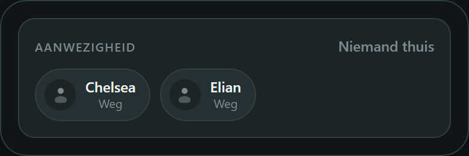 <code>fibbers-presence</code> who's home</td>
<td width="33%" align="center">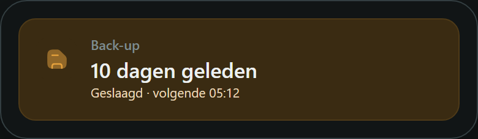 <code>fibbers-backup</code> backup status</td>
</tr>
<tr>
<td width="33%" align="center">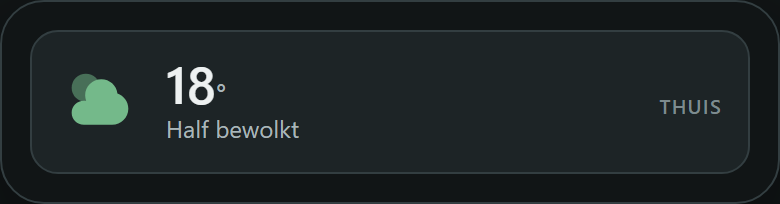 <code>fibbers-weather</code> forecast strip</td>
<td width="33%" align="center">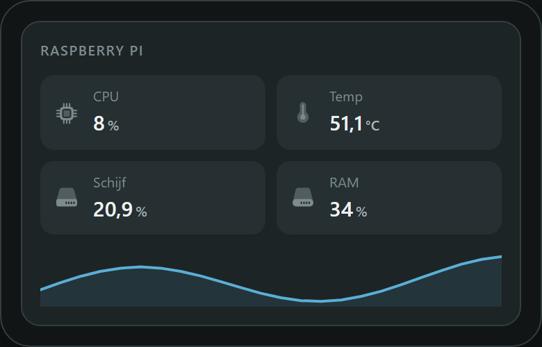 <code>fibbers-sysmon</code> host telemetry</td>
<td></td>
</tr>
</table>

## Devices

A media player, a thermostat, a universal remote, a wake scheduler, and a one-tile wake-up alarm.

<table>
<tr>
<td width="33%" align="center">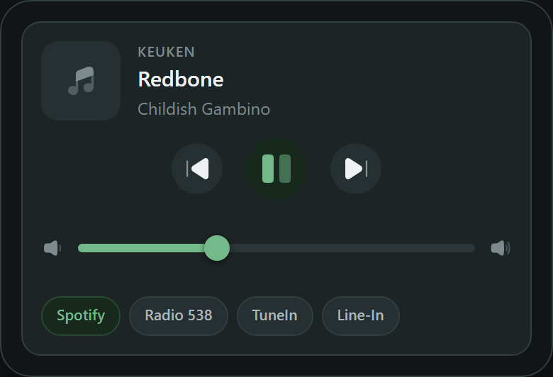 <code>fibbers-media</code> now-playing</td>
<td width="33%" align="center">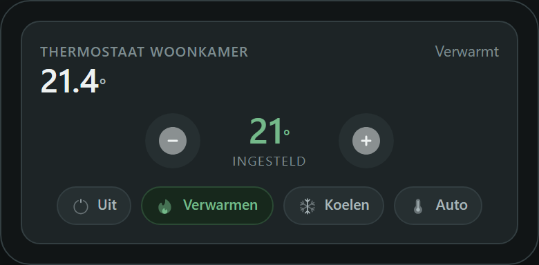 <code>fibbers-climate</code> thermostat</td>
<td width="33%" align="center">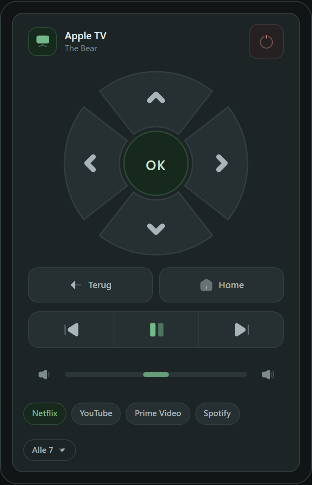 <code>fibbers-remote</code> universal remote</td>
</tr>
<tr>
<td width="33%" align="center">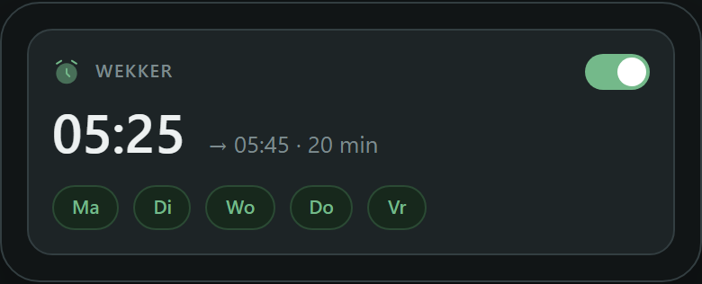 <code>fibbers-scheduler</code> wake control</td>
<td width="33%" align="center">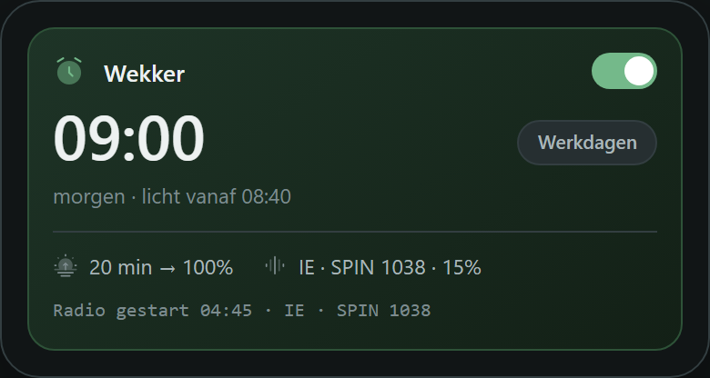 <code>fibbers-alarm</code> wake-up alarm</td>
<td></td>
</tr>
</table>

## Inputs & controls

Helpers for `input_number` / `input_select` / `input_boolean` / `input_datetime`.

<table>
<tr>
<td width="33%" align="center">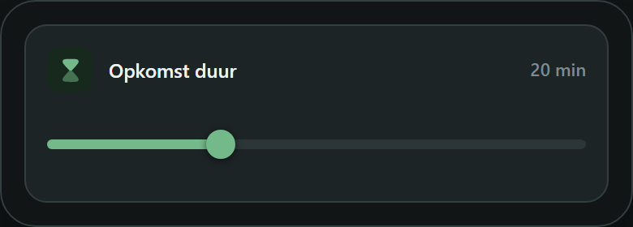 <code>fibbers-number</code> slider / stepper</td>
<td width="33%" align="center">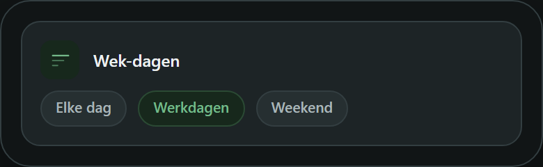 <code>fibbers-select</code> option picker</td>
<td width="33%" align="center">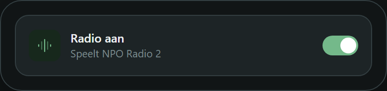 <code>fibbers-toggle</code> switch row</td>
</tr>
<tr>
<td width="33%" align="center">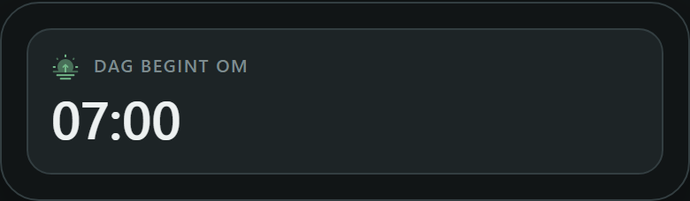 <code>fibbers-datetime</code> time / date</td>
<td></td>
<td></td>
</tr>
</table>
